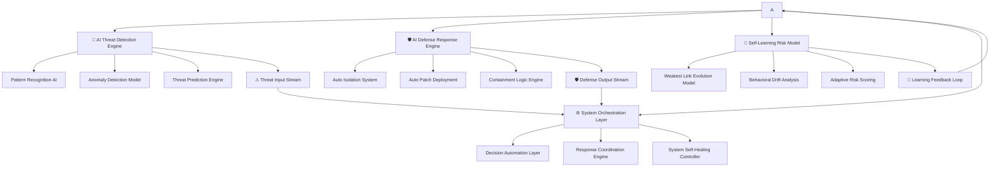

## 🌐 SYSTEM EVOLUTION

This framework represents the transition from:

> Human-driven cyber security → AI-native autonomous cyber intelligence

---

## ⚙️ ARCHITECTURE OVERVIEW

🧠 CORE PRINCIPLE

Cyber security is no longer a reactive system.

It is a continuously operating **autonomous intelligence loop**, where security is defined by perpetual adaptation rather than static defense.

---

🔄 SYSTEM BEHAVIOR MODEL

Observe → Detect → Predict → Act → Learn → Evolve → Repeat
