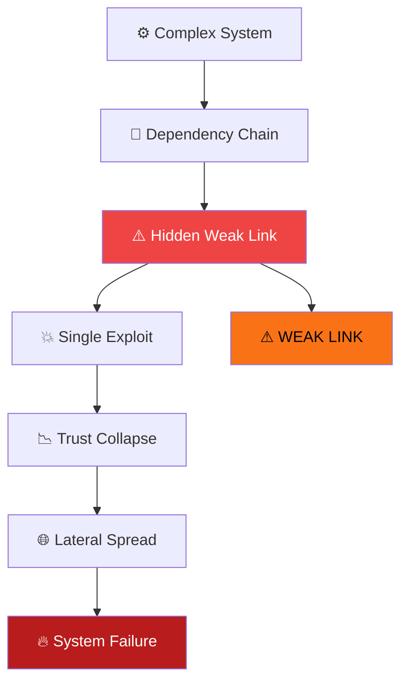

<p align="center">
  
</p>

<div align="center">

# 🧠 THE WEAKEST LINK  
## 🛡️ CYBER SECURITY FINAL DOCTRINE  
CYBER SINGULARITY CONVERGENCE MODEL

---

<span style="color:#39FF14; font-weight:bold; font-size:18px;">
“A system is only as strong as its weakest link.”
</span>

<br>

<span style="color:#39FF14; font-weight:bold;">
(Sebuah sistem hanya sekuat mata rantai terlemahnya.)
</span>

---

</div>

</div>

# 📘 ABSTRACT

This document defines a final-stage cyber security doctrine where cyber systems, artificial intelligence, and adversarial infrastructures converge into a single continuous conflict environment.

Cyber security is no longer a defensive discipline, but a **continuous stability management problem within autonomous hostile ecosystems**.

---

# 1. CORE THESIS

System security is not defined by protection strength, but by:

> The ability to prevent a single weakest link from becoming a systemic failure vector.

---

# 2. GLOBAL CYBER ARCHITECTURE MODEL

```mermaid
flowchart TB

A[🌐 GLOBAL CYBER ECOSYSTEM]

A --> B[👤 Human Layer]
A --> C[🧠 Identity Layer]
A --> D[🧩 Application Layer]
A --> E[🌐 Network Layer]
A --> F[🗄️ Infrastructure Layer]
A --> G[☁️ Cloud Layer]
A --> H[📜 Governance Layer]

B --> B1[Social Engineering]
B --> B2[Human Error]
B --> B3[Insider Threat]

C --> C1[Authentication Failure]
C --> C2[Privilege Abuse]

D --> D1[Injection Attacks]
D --> D2[Logic Exploits]
D --> D3[API Abuse]

E --> E1[Open Ports]
E --> E2[Misconfiguration]

F --> F1[Unpatched Systems]
F --> F2[Weak Hardening]

G --> G1[Exposed Storage]
G --> G2[IAM Misconfiguration]

H --> H1[Policy Gaps]
H --> H2[Audit Failure]

style A fill:#0f172a,stroke:#22c55e,stroke-width:3px,color:#ffffff
style B fill:#1e293b,stroke:#38bdf8,color:#ffffff
style C fill:#1e293b,stroke:#a78bfa,color:#ffffff
style D fill:#1e293b,stroke:#f97316,color:#ffffff
style E fill:#1e293b,stroke:#ef4444,color:#ffffff
style F fill:#1e293b,stroke:#eab308,color:#000000
style G fill:#1e293b,stroke:#06b6d4,color:#ffffff
style H fill:#1e293b,stroke:#f43f5e,color:#ffffff
```



## 3. ADVERSARIAL ATTACK MODEL (APT FLOW)


## 4. WEAK LINK PROPAGATION MODEL



## 5. WEAK LINK DYNAMICS

Weakness is not static.

It exists as a continuously evolving condition within complex systems:

- Human decision latency  
- System complexity overflow  
- Dependency chain opacity  
- AI model drift  
- Trust boundary misconfiguration  
- Unknown unknowns (unobserved risk states)  

---

## 6. CYBER SINGULARITY MODEL

The Cyber Singularity is the point where cyber attack and defense exceed human cognitive and operational speed.

At this stage:

- AI vs AI cyber conflict  
- Continuous autonomous warfare  
- No stable security equilibrium  
- Real-time adaptive feedback loops  

Security becomes a **self-evolving dynamic system**, not a controlled static state.

---

## 7. SYSTEM RISK EQUATION

```text
Risk ∝ (Attack Surface × Complexity × Adversarial Capability)
       ÷ (Weakest Link Stability × Detection Speed × Response Autonomy)
```

<div align="center">

## ☕ Support the Project

If this project has helped your research, learning, or security operations, consider supporting its continued development.

<div align="center">

<a href="https://www.paypal.com/paypalme/bungtempong99">

</a>

</div>

---
